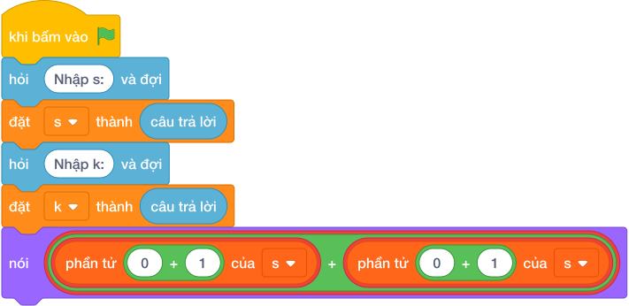

# Hướng Dẫn Giảng Dạy

## 1. Ý tưởng & Phân tích thuật toán
- Bản chất: chuỗi không xóa trực tiếp được nên ghép hai lát cắt bỏ qua vị trí `K`.
- Quy trình:
  - Đọc chuỗi vào `s` và số vào `k`. Với số liệu mẫu, `s = "PYTHON"`, `k = 2` (chữ `T`).
  - Lát trái `s[:2]` là `PY`, lát phải `s[3:]` là `HON` (bỏ qua vị trí 2).
  - Nối `PY + HON` thành `PYHON` rồi in ra.

---

## 2. Bảng chạy tay trên số liệu mẫu (Dry Run Table - Sample 1: PYTHON và 2)
| Bước | Lệnh chạy | Giá trị trong máy | Ghi chú |
|---|---|---|---|
| 1 | `s = câu trả lời` | `s = "PYTHON"` | P(0) Y(1) T(2) H(3) O(4) N(5) |
| 2 | `k = câu trả lời` | `k = 2` | cần xóa chữ T |
| 3 | `s[:k] + s[k + 1:]` | `"PY" + "HON" = "PYHON"` | bỏ đúng vị trí 2 |
| 4 | `nói (...)` | màn hình hiện `PYHON` | khớp Output mẫu |

---

## 3. Lưu ý & Bẫy lỗi thường gặp
- Bẫy 1: quên `+ 1` nên không xóa gì `s[:k] + s[k:]`. Đoạn sai:
```text
s = câu trả lời
k = câu trả lời
nói (s[:k] + s[k:])

```
Với mẫu `PYTHON` và `2` in ra nguyên `PYTHON`, đáp án đúng là `PYHON`. Cách sửa: lát phải bắt đầu từ `k + 1`.
- Bẫy 2: chỉ in lát trái `nói (s[:k])`. Đoạn sai:
```text
s = câu trả lời
k = câu trả lời
nói (s[:k])

```
Với mẫu trên chỉ in ra `PY`, thiếu hẳn `HON`, đáp án đúng là `PYHON`. Cách sửa: nối thêm `s[k + 1:]`.

---

## 4. Lời giải tham khảo & Kịch bản Khối lệnh Scratch 3.0

### 4.1. Khối lệnh đồ họa trực quan (Visual Scratch Blocks)



> 💡 **Kịch bản thực hiện từng bước:**
> - khi bấm vào cờ xanh
> - hỏi [Nhập s:] và đợi
> - đặt [s] thành (câu trả lời)
> - hỏi [Nhập k:] và đợi
> - đặt [k] thành (câu trả lời)
> - nói (giá trị + giá trị)
