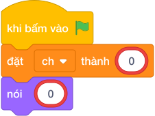

# Hướng Dẫn Giảng Dạy

## 1. Ý tưởng & Phân tích thuật toán
- Bản chất: chữ cái liền sau hơn chữ hiện tại đúng 1 đơn vị mã số.
- Quy trình:
  - Đọc chữ cái vào biến `ch`. Với số liệu mẫu, `ch = "C"` (mã 67).
  - Cộng 1 thành mã 68 rồi đổi ngược thành chữ bằng `chr(ord(ch) + 1)`.
  - Mã 68 là chữ `D` nên in ra `D`.

---

## 2. Bảng chạy tay trên số liệu mẫu (Dry Run Table - Sample 1: C)
| Bước | Lệnh chạy | Giá trị trong máy | Ghi chú |
|---|---|---|---|
| 1 | `ch = câu trả lời` | `ch = "C"` | mã 67 |
| 2 | `ord(ch) + 1` | `68` | bước sang mã kế tiếp |
| 3 | `nói (chr(68))` | màn hình hiện `D` | khớp Output mẫu |

---

## 3. Lưu ý & Bẫy lỗi thường gặp
- Bẫy 1: quên cộng 1 nên in lại chữ cũ. Đoạn sai:
```text
ch = câu trả lời
nói (chr(ord(ch)))

```
Với mẫu `C` in ra `C`, đáp án đúng là `D`. Cách sửa: cộng 1 `chr(ord(ch) + 1)`.
- Bẫy 2: in mã số thay vì chữ `nói (ord(ch) + 1)`. Đoạn sai:
```text
ch = câu trả lời
nói (ord(ch) + 1)

```
Với mẫu `C` in ra `68`, đáp án đúng là `D`. Cách sửa: bọc ngoài bằng `chr(...)`.

---

## 4. Lời giải tham khảo & Kịch bản Khối lệnh Scratch 3.0

### 4.1. Khối lệnh đồ họa trực quan (Visual Scratch Blocks)



> 💡 **Kịch bản thực hiện từng bước:**
> - khi bấm vào cờ xanh
> - đặt [ch] thành (giá trị)
> - nói (chr(...))
