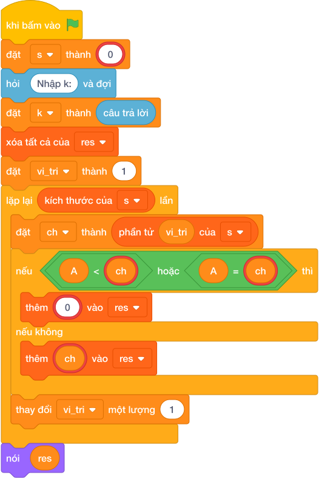

# Hướng Dẫn Giảng Dạy

## 1. Ý tưởng & Phân tích thuật toán
- Bản chất: giúp bạn Bin mã hóa thư bằng cách đẩy mỗi chữ cái sang phải `K` nấc, hết `Z` thì vòng lại `A`.
- Quy trình với biến thật (`s`, `k`, `res`, `ch`):
  - Đọc `s = "ABCXYZ"`, `k = 3`.
  - Với từng `ch`, tính `chr((ord(ch) - ord('A') + k) % 26 + ord('A'))`: `A` thành `D`, `B` thành `E`, `C` thành `F`, `X` thành `A`, `Y` thành `B`, `Z` thành `C`.
  - Nối lại được `DEFABC` rồi in ra.

---

## 2. Bảng chạy tay trên số liệu mẫu (Dry Run Table - Sample 1: ABCXYZ và 3)
| Bước | Lệnh chạy | Giá trị trong máy | Ghi chú |
|---|---|---|---|
| 1 | `s`, `k` | `s = "ABCXYZ"`, `k = 3` | thư gốc và bước nhảy |
| 2 | `A, B, C` cộng 3 | `D, E, F` | chưa chạm vòng |
| 3 | `X, Y, Z` cộng 3 | `A, B, C` | vòng lại từ đầu |
| 4 | `nói ("".join(res))` | màn hình hiện `DEFABC` | khớp Output mẫu |

---

## 3. Lưu ý & Bẫy lỗi thường gặp
- Bẫy 1: cộng trực tiếp `chr(ord(ch) + k)` nên `X, Y, Z` văng khỏi bảng chữ. Đoạn sai:
```text
s = câu trả lời
k = câu trả lời
res = []
for ch in s:
    res.append(chr(ord(ch) + k))
nói ("".join(res))

```
Với mẫu `ABCXYZ` và `3`, ba chữ cuối thành ký tự lạ `[/]` thay vì `ABC`, đáp án đúng là `DEFABC`. Cách sửa: vòng lại bằng `% 26` như lời giải.
- Bẫy 2: quên đọc `k` mà dùng số cố định. Đoạn sai khiến mọi bước nhảy khác 3 đều cho kết quả sai, ví dụ mẫu cần `DEFABC` nhưng với `k = 1` đúng ra phải là `BCDYZA`. Cách sửa: đọc `k = int(câu trả lời)`.

---

## 4. Lời giải tham khảo & Kịch bản Khối lệnh Scratch 3.0

### 4.1. Khối lệnh đồ họa trực quan (Visual Scratch Blocks)



> 💡 **Kịch bản thực hiện từng bước:**
> - khi bấm vào cờ xanh
> - đặt [s] thành (giá trị)
> - hỏi [Nhập k:] và đợi
> - đặt [k] thành (câu trả lời)
> - xóa tất cả của [res]
> - đặt [vi_tri] thành 1
> - lặp lại (kích thước của s) lần:
> -   đặt [ch] thành phần tử thứ (vi_tri)
> -   nếu <A <= ch> thì:
> -     thêm (chr(...)) vào [res]
> -   nếu không thì:
> -     thêm (ch) vào [res]
> -   thay đổi [vi_tri] một lượng 1
> - nói (res)
