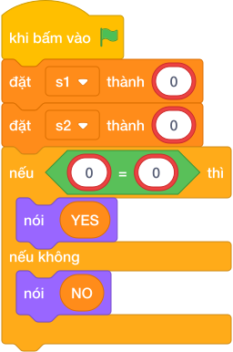

# Hướng Dẫn Giảng Dạy

## 1. Ý tưởng & Phân tích thuật toán
- Bản chất: hai từ là hoán vị của nhau khi chúng gồm đúng cùng một bộ chữ cái, chỉ khác thứ tự xếp.
- Quy trình:
  - Đọc hai từ vào `s1` và `s2`. Với số liệu mẫu, `s1 = "listen"`, `s2 = "silent"`.
  - Sắp xếp chữ cái hai từ bằng `sorted(...)`: cả hai đều thành `['e', 'i', 'l', 'n', 's', 't']`.
  - Hai danh sách bằng nhau nên in `YES` (ngược lại in `NO`).

---

## 2. Bảng chạy tay trên số liệu mẫu (Dry Run Table - Sample 1: listen và silent)
| Bước | Lệnh chạy | Giá trị trong máy | Ghi chú |
|---|---|---|---|
| 1 | `s1 = câu trả lời` | `s1 = "listen"` | từ thứ nhất |
| 2 | `s2 = câu trả lời` | `s2 = "silent"` | từ thứ hai |
| 3 | `sorted(s1)` và `sorted(s2)` | cùng `['e', 'i', 'l', 'n', 's', 't']` | cùng bộ chữ cái |
| 4 | so sánh bằng nhau | đúng nên `nói ("YES")` | khớp Output mẫu |

---

## 3. Lưu ý & Bẫy lỗi thường gặp
- Bẫy 1: so trực tiếp `s1 == s2` mà không sắp xếp. Đoạn sai:
```text
s1 = câu trả lời
s2 = câu trả lời
if s1 == s2:
    nói ("YES")
else:
    nói ("NO")

```
Với mẫu `listen` và `silent` in ra `NO`, đáp án đúng là `YES`. Cách sửa: so `sorted(s1) == sorted(s2)`.
- Bẫy 2: so độ dài thay vì so chữ cái. Đoạn sai:
```text
s1 = câu trả lời
s2 = câu trả lời
if len(s1) == len(s2):
    nói ("YES")
else:
    nói ("NO")

```
Với hai từ dài bằng nhau nhưng khác chữ (ví dụ `abc` và `xyz`) vẫn in `YES` là kết quả sai. Cách sửa: so `sorted(s1) == sorted(s2)`.

---

## 4. Lời giải tham khảo & Kịch bản Khối lệnh Scratch 3.0

### 4.1. Khối lệnh đồ họa trực quan (Visual Scratch Blocks)



> 💡 **Kịch bản thực hiện từng bước:**
> - khi bấm vào cờ xanh
> - đặt [s1] thành (giá trị)
> - đặt [s2] thành (giá trị)
> - nếu <sorted(...) = sorted(...)> thì:
> -   nói (YES)
> - nếu không thì:
> -   nói (NO)
