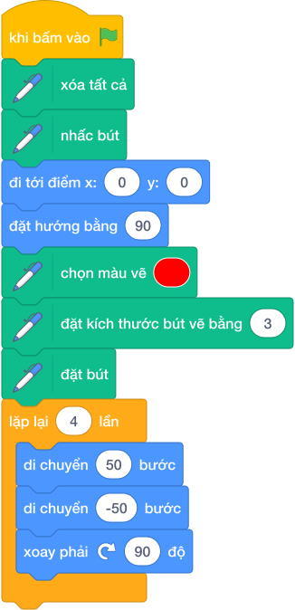

# HƯỚNG DẪN GIẢNG DẠY: KHỞI ĐỘNG NÉT VẼ & DẤU CỘNG TRUNG TÂM
**Mã bài toán:** `sca_pen_p00` | **Phân tầng:** P0 (Khởi động)

---

## 1. Mục Tiêu Học Tập & Chuẩn Đầu Ra (Learning Objectives)
- Củng cố phản xạ khởi tạo giấy bút: `erase all` $\to$ `pen up` $\to$ `go to x: 0 y: 0` $\to$ `point in direction 90` $\to$ `pen down`.
- Làm chủ kỹ thuật vẽ "tiến rồi lùi về gốc" (`move 50` $\to$ `move -50`).
- Hiểu góc xoay vuông góc $90^\circ$ giữa 4 hướng không gian.

## 2. Phân Tích Đề Bài & Bản Chất Kỹ Thuật (Edge Cases)
- **Vấn đề cốt lõi:** Làm thế nào để vẽ 4 nhánh tỏa ra từ một điểm trung tâm mà nét mực không bị chồng chéo méo mó?
- **Cách tiếp cận tối ưu:** Mỗi chu kỳ gồm 3 bước: Đi tới trước $50$ bước $\to$ Lùi lại $-50$ bước $\to$ Xoay phải $90^\circ$. Lặp lại đúng $4$ lần.
- **Edge cases:**
  - Nếu học sinh chỉ đi tới $50$ rồi xoay $90$ và đi tiếp, nhân vật sẽ vẽ thành hình vuông nhỏ chứ không phải dấu cộng.
  - Quên thiết lập tọa độ ban đầu khiến dấu cộng bị lệch khỏi tâm sân khấu.

## 3. Câu Hỏi Gợi Mở Dẫn Dắt (Socratic Method)

1. *"Trước khi cầm bút vẽ trên trang giấy trắng, ta cần chuẩn bị gì?"* $\to$ Xóa sạch trang giấy cũ (`erase all`), chọn màu mực và gọt bút chì (`set pen size`).

2. *"Sau khi chú Mèo vẽ xong 1 nhánh dài 50 bước, chú Mèo đang ở đâu?"* $\to$ Đang ở đầu mút của nhánh cây.

3. *"Làm thế nào để chú Mèo quay về điểm xuất phát để vẽ nhánh thứ 2?"* $\to$ Cho chú Mèo đi lùi $-50$ bước (`move -50 steps`).

## 4. Chiến Lược Tối Ưu & Bất Biến Thuật Toán (Invariant)
- **Bất biến sau mỗi nhánh:** Sau mỗi lần lặp, nhân vật luôn trở về đúng tọa độ ban đầu $(0, 0)$ và hướng xoay tăng thêm $90^\circ$.
- **Độ phức tạp:** Thực thi 4 lần lặp, thời gian chạy tức thời $\mathcal{O}(1)$.

## 5. Mô Phỏng Từng Bước Trên Sample (Dry Run Table)

| Vòng lặp | Lệnh thực thi | Vị trí nhân vật | Nét mực tạo ra | Hướng sau lệnh |
|:---:|---|:---:|---|:---:|
| **Init** | `go to x: 0 y: 0`, `point 90`, `pen down` | $(0, 0)$ | Chấm đỏ tại tâm | $90^\circ$ (Phải) |
| **Lần 1** | `move (50)`, `move (-50)`, `turn right (90)` | $(0, 0)$ | Đoạn thẳng sang phải $(0, 0) \to (50, 0)$ | $180^\circ$ (Xuống) |
| **Lần 2** | `move (50)`, `move (-50)`, `turn right (90)` | $(0, 0)$ | Đoạn thẳng cắm xuống $(0, 0) \to (0, -50)$ | $-90^\circ$ (Trái) |
| **Lần 3** | `move (50)`, `move (-50)`, `turn right (90)` | $(0, 0)$ | Đoạn thẳng sang trái $(0, 0) \to (-50, 0)$ | $0^\circ$ (Lên) |
| **Lần 4** | `move (50)`, `move (-50)`, `turn right (90)` | $(0, 0)$ | Đoạn thẳng hướng lên $(0, 0) \to (0, 50)$ | $90^\circ$ (Phải) |

## 6. Phân Tích Độ Phức Tạp Thời Gian & Không Gian
- Thời gian: $\mathcal{O}(1)$ — hoàn thành trong $0.05$ giây trên sân khấu Scratch.
- Không gian: Sử dụng $1$ Sprite mặc định, không tốn bộ nhớ RAM.

## 7. Các Bẫy Lỗi Lập Trình Kinh Điển (Bug Traps)
- **Bẫy 1:** Nhập `di chuyển (50) bước` rồi lại `di chuyển (50) bước` $\to$ Nhân vật đi tiếp $100$ bước. Phải giải thích cho học sinh: Số âm mang ý nghĩa đi lùi (`di chuyển (-50) bước`).
- **Bẫy 2:** Quên khối `đặt bút` $\to$ Chú Mèo nhảy múa nhưng không để lại nét mực nào trên màn hình.

## 8. Mã Nguồn Khối Lệnh Tham Chiếu Chuẩn (Visual Scratch Blocks)

*Quy trình thực hiện bằng Tiếng Việt:*

1. 🟡 **Khi bấm vào cờ xanh**

2. 🟢 **Xóa tất cả**

3. 🟢 **Nhấc bút**

4. 🔵 **Đi tới điểm x: (0) y: (0)**

5. 🔵 **Đặt hướng bằng (90)**

6. 🟢 **Chọn màu vẽ [Đỏ]**

7. 🟢 **Đặt kích thước bút vẽ bằng (3)**

8. 🟢 **Đặt bút**

9. 🟠 **Lặp lại (4) lần:**
   - 🔵 `di chuyển (50) bước` (vẽ 1 nhánh)
   - 🔵 `di chuyển (-50) bước` (lùi về tâm)
   - 🔵 `xoay phải ↻ (90) độ` (quay sang hướng tiếp theo)

## 9. Bài Toán Mở Rộng & Chuyển Giao (Transfer & Extensions)
- **Mở rộng 1:** Thay vì vẽ dấu cộng 4 cánh, em hãy đổi góc xoay thành $60^\circ$ và lặp lại $6$ lần để tạo thành bông hoa tuyết 6 cánh.
- **Mở rộng 2:** Đổi góc xoay thành $45^\circ$ và lặp lại $8$ lần để tạo thành ngôi sao 8 cánh.

## 4. Lời giải tham khảo & Kịch bản Khối lệnh Scratch 3.0

### 4.1. Khối lệnh đồ họa trực quan (Visual Scratch Blocks)

> 💡 **Kịch bản thực hiện từng bước:**
> - khi bấm vào cờ xanh
> - xóa tất cả
> - nhấc bút
> - đi tới điểm x: (0) y: (0)
> - đặt hướng bằng (90)
> - đặt màu bút vẽ thành màu đỏ
> - đặt kích thước bút vẽ bằng (3)
> - đặt bút
> - lặp lại (4) lần:
> -   di chuyển (50) bước
> -   di chuyển (-50) bước
> -   xoay phải ↻ (90) độ
