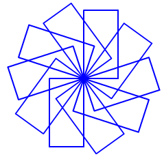
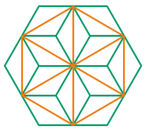
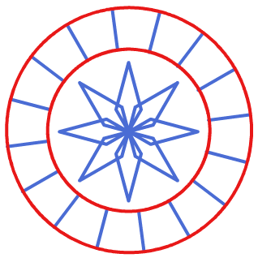
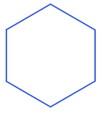

# Bàn Phím Đa Giác Tương Tác

## Bối cảnh

Nhà thiết kế game muốn người chơi tương tác bằng các phím số 1, 2, 3, 4 trên bàn phím để vẽ nhanh các hình khối tương ứng.

## Nhiệm vụ

Lập trình sự kiện: Phím 1 vẽ Tam giác đều, Phím 2 vẽ Hình vuông, Phím 3 vẽ Ngũ giác đều, Phím 4 vẽ Lục giác đều.

## Kịch bản tương tác (Input Scenario)

- Nhấn phím 1, 2, 3 hoặc 4 trên bàn phím.

## Kết quả mong đợi (Expected Behavior / Output)

- Mỗi phím vẽ ra hình đa giác tương ứng với màu sắc khác nhau.

## Hình ảnh minh họa kết quả mẫu

## Sample 1

### Kịch bản chạy trên sân khấu

- **Thao tác khởi động:** Nhấn phím 1, 2, 3 hoặc 4 trên bàn phím.

- **Kết quả hình ảnh:** Mỗi phím vẽ ra hình đa giác tương ứng với màu sắc khác nhau.

### Giải thích

Bấm phím 1 -> Mèo vẽ Tam giác màu đỏ. Bấm phím 2 -> Mèo vẽ Hình vuông màu xanh.

## Ràng buộc

- Môi trường: Scratch 3.0 với phần mở rộng Bút vẽ (Pen).

- Tọa độ khởi tạo an toàn trong khung hình sân khấu (x: -240 đến 240, y: -180 đến 180).

- Nguồn bài thi: Trích xuất từ tài liệu chuẩn `Câu 2 - CHỦ ĐỀ VẼ HÌNH TRÊN SCRATCH.docx`.
