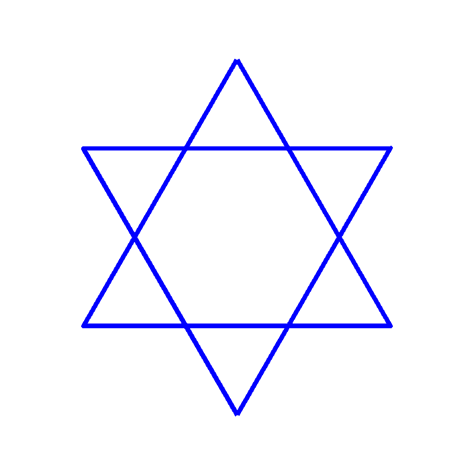

# Cặp Tam Giác Đối Xứng Qua Tâm

## Bối cảnh

Biểu tượng của hội toán học gồm hai hình tam giác đều ghép đối xứng nhau tạo thành hình ngôi sao 6 cánh David.

## Nhiệm vụ

Vẽ 1 tam giác đều hướng lên, sau đó đổi hướng 180 độ và vẽ tam giác đều thứ hai lồng vào nhau.

## Kịch bản tương tác (Input Scenario)

- Khởi động khi người dùng nhấn vào biểu tượng **Cờ Xanh**.

- Không yêu cầu nhập dữ liệu từ bàn phím.

## Kết quả mong đợi (Expected Behavior / Output)

- Hai hình tam giác lồng nhau tạo thành ngôi sao 6 cánh sắc nét.

## Hình ảnh minh họa kết quả mẫu

## Sample 1

### Kịch bản chạy trên sân khấu

- **Thao tác khởi động:** Nhấn cờ xanh.

- **Kết quả hình ảnh:** Hai hình tam giác lồng nhau tạo thành ngôi sao 6 cánh sắc nét.

### Giải thích

Vẽ tam giác 1, nhấc bút di chuyển đến vị trí đối xứng, đặt bút vẽ tam giác 2.

## Ràng buộc

- Môi trường: Scratch 3.0 với phần mở rộng Bút vẽ (Pen).

- Tọa độ khởi tạo an toàn trong khung hình sân khấu (x: -240 đến 240, y: -180 đến 180).

- Nguồn bài thi: Trích xuất từ tài liệu chuẩn `Câu 4 - CHỦ ĐỀ VẼ HÌNH TRÊN SCRATCH.docx`.
