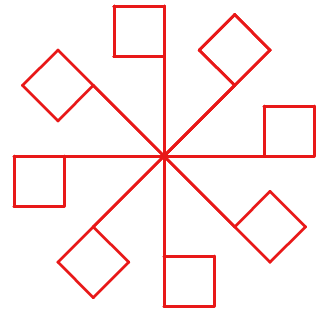

# Lá Cờ Xoay Vòng Quanh Tâm

## Bối cảnh

Lễ hội thể thao cần một họa tiết gồm các lá cờ tam giác xoay tròn xung quanh cột cờ trung tâm.

## Nhiệm vụ

Tạo mảnh ghép lá cờ (My Blocks), sau đó dùng vòng lặp quay quanh tâm để vẽ N lá cờ.

## Kịch bản tương tác (Input Scenario)

- Nhập số lượng lá cờ N từ bàn phím.

## Kết quả mong đợi (Expected Behavior / Output)

- Họa tiết chong chóng lá cờ xoay đều 360 độ quanh tâm.

## Hình ảnh minh họa kết quả mẫu

## Sample 1

### Kịch bản chạy trên sân khấu

- **Thao tác khởi động:** Nhập số lượng lá cờ N từ bàn phím.

- **Kết quả hình ảnh:** Họa tiết chong chóng lá cờ xoay đều 360 độ quanh tâm.

### Giải thích

Nhập N = 8 -> Xoay mỗi bước 360 / 8 = 45 độ, vẽ 8 lá cờ.

## Ràng buộc

- Môi trường: Scratch 3.0 với phần mở rộng Bút vẽ (Pen).

- Tọa độ khởi tạo an toàn trong khung hình sân khấu (x: -240 đến 240, y: -180 đến 180).

- Nguồn bài thi: Trích xuất từ tài liệu chuẩn `Câu 6 - CHỦ ĐỀ VẼ HÌNH TRÊN SCRATCH.docx`.
