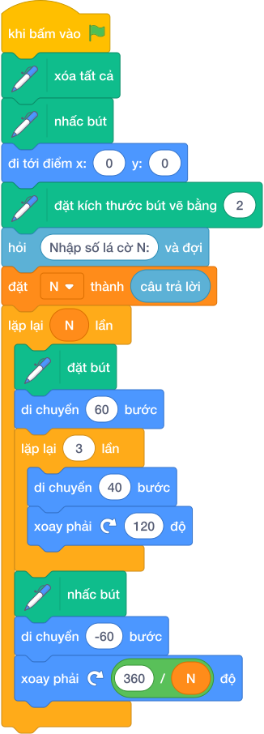

# HƯỚNG DẪN GIẢNG DẠY: LÁ CỜ XOAY VÒNG QUANH TÂM
Chuyên đề: **Đồ Họa Bút Vẽ (Pen) & Thuật Toán Hình Học Scratch 3.0**  
Mã bài toán: `sca_pen_p06_la_co_xoay_vong` | Nguồn tham chiếu: `Câu 6`

---

## 1. Ý tưởng & Phân tích thuật toán
- **Bản chất hình học:** Bài toán rèn luyện tư duy chia nhỏ hình phức tạp thành các hình con cơ bản (đa giác đều, cung tròn, nhánh hoa văn).
- **Quy tắc bảo toàn góc quay:** Tổng các góc quay khi đi hết 1 vòng khép kín luôn bằng $360^\circ$.
- **Kỹ thuật đóng gói My Blocks:** Khuyến khích học sinh định nghĩa thủ tục con (ví dụ: `Vẽ_Cánh_Hoa`, `Vẽ_Nhánh`) với các tham số độ dài, bán kính để tái sử dụng nhiều lần.

---

## 2. Bảng chạy tay trên số liệu mẫu (Dry Run Table)
| Bước | Khối lệnh Scratch Tiếng Việt | Vị trí (x, y) | Hướng | Tác dụng |
|:---:|---|:---:|:---:|---|
| 1 | `khi bấm vào cờ xanh` | (0, 0) | 90 | Khởi động kịch bản |
| 2 | `xóa tất cả` | (0, 0) | 90 | Dọn sạch sân khấu |
| 3 | `nhấc bút`, `đi tới điểm x: 0 y: 0` | (0, 0) | 90 | Đưa nhân vật về tâm |
| 4 | `đặt kích thước bút vẽ bằng (3)` | (0, 0) | 90 | Đặt nét vẽ rõ nét |
| 5 | `đặt bút`, thực hiện vòng lặp | Thay đổi | Thay đổi | Vẽ hình theo yêu cầu |

---

## 3. Lưu ý & Bẫy lỗi thường gặp
- **Bẫy 1 (Góc trong vs Góc ngoài):** Học sinh hay nhầm góc quay ngoài của nhân vật với góc trong của đa giác (ví dụ tam giác đều quay $120^\circ$ chứ không phải $60^\circ$).
- **Bẫy 2 (Lem nét vẽ thừa):** Quên `nhấc bút` khi di chuyển nhân vật đến vị trí xuất phát mới khiến đường đi để lại vệt mực xấu.
- **Bẫy 3 (Vẽ tràn sân khấu):** Chọn bán kính hoặc độ dài cạnh quá lớn khiến nhân vật chạm biên màn hình và hình vẽ bị méo mó.

---

## 4. Lời giải tham khảo & Kịch bản Khối lệnh Scratch 3.0

### 4.1. Khối lệnh đồ họa trực quan (Visual Scratch Blocks)

> 💡 **Kịch bản thực hiện từng bước:**
> - khi bấm vào cờ xanh
> - xóa tất cả, nhấc bút, đi tới điểm x: (0) y: (0)
> - hỏi [Nhập số lá cờ N:] và đợi, đặt [N] thành (câu trả lời)
> - lặp lại (N) lần:
> -   đặt bút, di chuyển (60) bước (cột cờ)
> -   lặp lại (3) lần: di chuyển (40) bước, xoay phải ↻ (120) độ (lá cờ)
> -   nhấc bút, di chuyển (-60) bước (lùi về tâm)
> -   xoay phải ↻ (360 / N) độ
