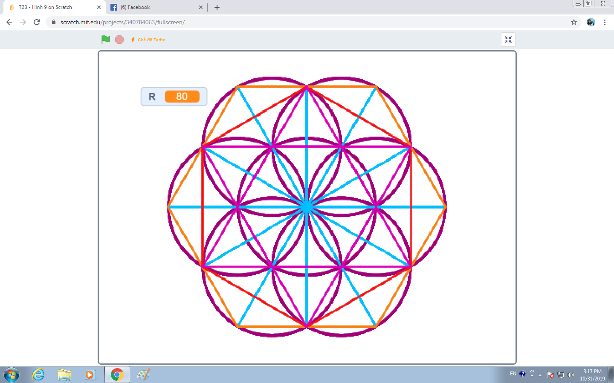

# Ngôi Sao 5 Cánh Khép Kín

## Bối cảnh

Vẽ lá cờ Tổ quốc Việt Nam với ngôi sao vàng 5 cánh rực rỡ ở chính giữa.

## Nhiệm vụ

Vẽ ngôi sao 5 cánh nét liền với góc quay đỉnh sao là 144 độ (hoặc 72 độ).

## Kịch bản tương tác (Input Scenario)

- Khởi động khi người dùng nhấn vào biểu tượng **Cờ Xanh**.

- Không yêu cầu nhập dữ liệu từ bàn phím.

## Kết quả mong đợi (Expected Behavior / Output)

- Ngôi sao 5 cánh hoàn hảo khép kín.

## Hình ảnh minh họa kết quả mẫu

## Sample 1

### Kịch bản chạy trên sân khấu

- **Thao tác khởi động:** Nhấn cờ xanh.

- **Kết quả hình ảnh:** Ngôi sao 5 cánh hoàn hảo khép kín.

### Giải thích

Lặp 5 lần: [Đi 150 bước, Xoay phải 144 độ].

## Ràng buộc

- Môi trường: Scratch 3.0 với phần mở rộng Bút vẽ (Pen).

- Tọa độ khởi tạo an toàn trong khung hình sân khấu (x: -240 đến 240, y: -180 đến 180).

- Nguồn bài thi: Trích xuất từ tài liệu chuẩn `Câu 50, 51 - CHỦ ĐỀ VẼ HÌNH TRÊN SCRATCH.docx`.
