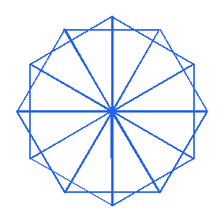

# Hoa Văn Tam Giác Xoay Chồng

## Bối cảnh

Họa tiết gạch men cổ điển tạo bởi các hình tam giác đều xoay quanh một đỉnh chung.

## Nhiệm vụ

Lập trình vẽ N hình tam giác đều chung một đỉnh, mỗi lần vẽ xoay một góc 360 / N độ.

## Kịch bản tương tác (Input Scenario)

- Nhập số hình tam giác N.

## Kết quả mong đợi (Expected Behavior / Output)

- Bông hoa hình học đa giác xoay đều sắc sảo.

## Hình ảnh minh họa kết quả mẫu

## Sample 1

### Kịch bản chạy trên sân khấu

- **Thao tác khởi động:** Nhập số hình tam giác N.

- **Kết quả hình ảnh:** Bông hoa hình học đa giác xoay đều sắc sảo.

### Giải thích

N = 12 -> Xoay mỗi lần 30 độ, vẽ 12 tam giác.

## Ràng buộc

- Môi trường: Scratch 3.0 với phần mở rộng Bút vẽ (Pen).

- Tọa độ khởi tạo an toàn trong khung hình sân khấu (x: -240 đến 240, y: -180 đến 180).

- Nguồn bài thi: Trích xuất từ tài liệu chuẩn `Câu 7 - CHỦ ĐỀ VẼ HÌNH TRÊN SCRATCH.docx`.
