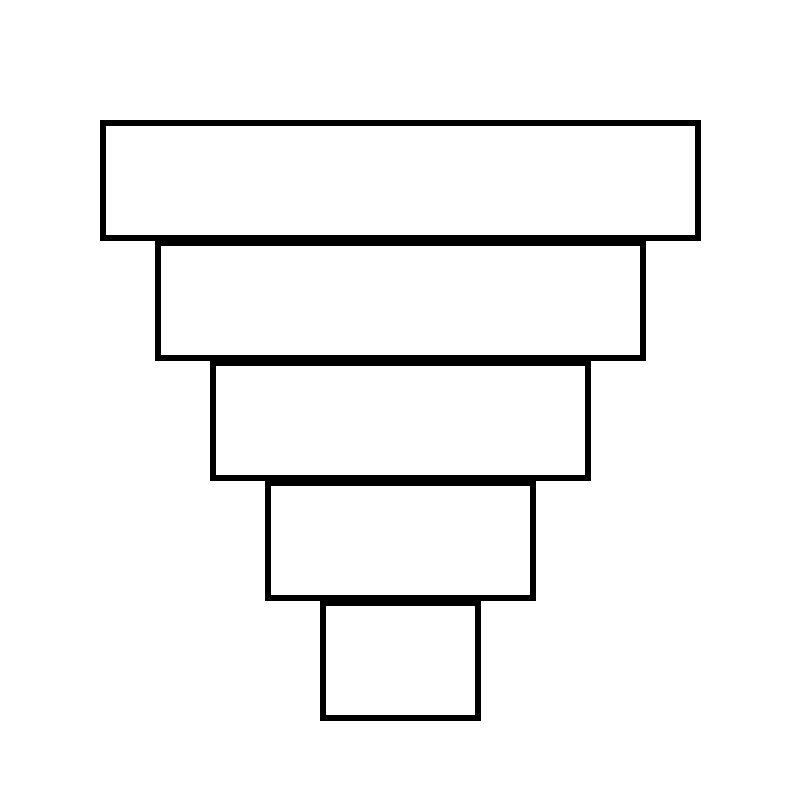

# Kim Tự Tháp Bậc Thang

## Bối cảnh

Kỳ quan Kim tự tháp Ai Cập cổ đại được xây dựng từ các tầng đá xếp chồng lên nhau hình bậc thang.

## Nhiệm vụ

Lập trình vẽ Kim tự tháp có N bậc thang, mỗi bậc có độ dài thu hẹp dần lên đỉnh.

## Kịch bản tương tác (Input Scenario)

- Nhập số tầng N (ví dụ N = 5).

## Kết quả mong đợi (Expected Behavior / Output)

- Hình vẽ Kim tự tháp bậc thang cân xứng.

## Hình ảnh minh họa kết quả mẫu

## Sample 1

### Kịch bản chạy trên sân khấu

- **Thao tác khởi động:** Nhập số tầng N (ví dụ N = 5).

- **Kết quả hình ảnh:** Hình vẽ Kim tự tháp bậc thang cân xứng.

### Giải thích

Tầng 1 rộng 150, tầng 2 rộng 120, tầng 3 rộng 90...

## Ràng buộc

- Môi trường: Scratch 3.0 với phần mở rộng Bút vẽ (Pen).

- Tọa độ khởi tạo an toàn trong khung hình sân khấu (x: -240 đến 240, y: -180 đến 180).

- Nguồn bài thi: Trích xuất từ tài liệu chuẩn `Câu 32 - CHỦ ĐỀ VẼ HÌNH TRÊN SCRATCH.docx`.
