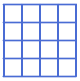
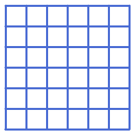

# Bàn Cờ Lưới Ô Vuông M x N

## Bối cảnh

Thiết kế bàn cờ caro hoặc mê cung lưới hình chữ nhật gồm nhiều ô vuông nhỏ liền kề.

## Nhiệm vụ

Sử dụng 2 vòng lặp lồng nhau điều khiển tọa độ để vẽ lưới gồm R hàng và C cột ô vuông.

## Kịch bản tương tác (Input Scenario)

- Nhập số hàng R và số cột C.

## Kết quả mong đợi (Expected Behavior / Output)

- Lưới ô vuông thẳng tắp, đều đặn.

## Hình ảnh minh họa kết quả mẫu

## Sample 1

### Kịch bản chạy trên sân khấu

- **Thao tác khởi động:** Nhập số hàng R và số cột C.

- **Kết quả hình ảnh:** Lưới ô vuông thẳng tắp, đều đặn.

### Giải thích

R = 4, C = 5 -> Vẽ lưới 4x5 ô vuông.

## Ràng buộc

- Môi trường: Scratch 3.0 với phần mở rộng Bút vẽ (Pen).

- Tọa độ khởi tạo an toàn trong khung hình sân khấu (x: -240 đến 240, y: -180 đến 180).

- Nguồn bài thi: Trích xuất từ tài liệu chuẩn `Câu 38, 40, 47 - CHỦ ĐỀ VẼ HÌNH TRÊN SCRATCH.docx`.
