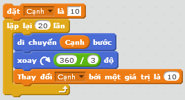

# Biểu tượng 5 vòng tròn Olympic thế giới

## Bối cảnh

Thế vận hội Olympic là ngày hội thể thao lớn nhất hành tinh, nơi các vận động viên xuất sắc nhất từ khắp các châu lục cùng nhau tranh tài. Biểu tượng chính thức của Olympic gồm 5 vòng tròn lồng vào nhau trên nền trắng, tượng trưng cho tình đoàn kết và hữu nghị của 5 châu lục:
- Hàng trên gồm 3 vòng tròn: **Xanh da trời** (Châu Âu), **Đen** (Châu Phi), **Đỏ** (Châu Mỹ).
- Hàng dưới gồm 2 vòng tròn: **Vàng** (Châu Á), **Xanh lá cây** (Châu Đại Dương).

Nhân dịp Thế vận hội sắp khai mạc, chú Mèo Scratch được giao nhiệm vụ thiết kế biểu tượng thể thao này bằng những nét vẽ lập trình sắc sảo và chính xác.

## Nhiệm vụ

Em hãy lập trình điều khiển chú Mèo Scratch vẽ lại biểu tượng 5 vòng tròn Olympic với các yêu cầu kỹ thuật sau:
1. Độ dày nét vẽ của các vòng tròn là $6$.
2. Mỗi vòng tròn có bán kính $R = 40$ bước (được tạo bằng cách lặp lại $360$ lần: mỗi lần đi khoảng $0.7$ bước rồi xoay phải $1^\circ$).
3. Vị trí và màu sắc của 5 vòng tròn được bố trí như sau:
   - **Hàng trên** (cùng độ cao $y = 40$):
     - Vòng 1: Màu xanh da trời, bắt đầu từ $x = -110, y = 40$.
     - Vòng 2: Màu đen, bắt đầu từ $x = -30, y = 40$.
     - Vòng 3: Màu đỏ, bắt đầu từ $x = 50, y = 40$.
   - **Hàng dưới** (cùng độ cao $y = 0$, so le lồng vào giữa các vòng hàng trên):
     - Vòng 4: Màu vàng, bắt đầu từ $x = -70, y = 0$.
     - Vòng 5: Màu xanh lá cây, bắt đầu từ $x = 10, y = 0$.
4. Giữa mỗi lần vẽ xong một vòng tròn, nhân vật bắt buộc phải nhấc bút trước khi di chuyển sang vị trí mới để không để lại vệt mực thừa.

## Kịch bản tương tác (Input Scenario)

- Bắt đầu khi người dùng nhấn vào biểu tượng **Cờ Xanh**.
- Chương trình tự động thiết lập và vẽ trọn vẹn 5 vòng tròn.

## Kết quả mong đợi (Expected Behavior / Output)

- Biểu tượng 5 vòng tròn Olympic hiện ra ngay ngắn, cân đối ở trung tâm sân khấu.
- Các vòng tròn có kích thước bằng nhau, nét vẽ đậm $6$, màu sắc tươi sáng đúng chuẩn.
- Hoàn toàn không có đường mực nối giữa các vòng tròn.

## Hình ảnh minh họa kết quả mẫu



## Sample 1

### Kịch bản chạy
```text
Sự kiện: Bấm Cờ Xanh
Hành động:
- Xóa màn hình, đặt nét vẽ to bằng 6
- Vẽ vòng 1 tại (-110, 40): Màu Xanh da trời
- Nhấc bút, chuyển sang (-30, 40), đặt bút
- Vẽ vòng 2 tại (-30, 40): Màu Đen
- Nhấc bút, chuyển sang (50, 40), đặt bút
- Vẽ vòng 3 tại (50, 40): Màu Đỏ
- Nhấc bút, chuyển sang (-70, 0), đặt bút
- Vẽ vòng 4 tại (-70, 0): Màu Vàng
- Nhấc bút, chuyển sang (10, 0), đặt bút
- Vẽ vòng 5 tại (10, 0): Màu Xanh lá cây
- Nhấc bút, ẩn nhân vật
```

### Kết quả trên sân khấu
Logo 5 vòng tròn Olympic hiện lên hoàn chỉnh tại trung tâm sân khấu như hình mẫu.

### Giải thích
Chương trình lần lượt thực hiện quy trình chuẩn: di chuyển tới tọa độ đích $\to$ đổi màu tương ứng $\to$ hạ bút $\to$ quay một vòng tròn khép kín $\to$ nhấc bút. Nhờ giữ khoảng cách ngang giữa các tâm là $80$ bước và độ lệch dọc $40$ bước, hai hàng vòng tròn lồng ghép so le rất đẹp mắt.

## Ràng buộc

- Bán kính mỗi vòng tròn: $R = 40$ bước.
- Độ dày nét bút: $6$.
- Giới hạn thời gian: Vẽ xong trong vòng $2.0$ giây.
