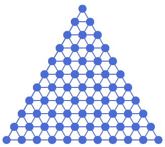

# Tam Giác Nhiều Tầng Xếp Chồng

## Bối cảnh

Mô hình tháp tam giác gồm các viên gạch tam giác nhỏ xếp sít nhau thành hình tam giác lớn.

## Nhiệm vụ

Vẽ tháp tam giác có T tầng, tầng đáy có T hình tam giác.

## Kịch bản tương tác (Input Scenario)

- Nhập số tầng T từ bàn phím.

## Kết quả mong đợi (Expected Behavior / Output)

- Tháp tam giác hùng vĩ trên sân khấu.

## Hình ảnh minh họa kết quả mẫu

## Sample 1

### Kịch bản chạy trên sân khấu

- **Thao tác khởi động:** Nhập số tầng T từ bàn phím.

- **Kết quả hình ảnh:** Tháp tam giác hùng vĩ trên sân khấu.

### Giải thích

T = 3 tầng.

## Ràng buộc

- Môi trường: Scratch 3.0 với phần mở rộng Bút vẽ (Pen).

- Tọa độ khởi tạo an toàn trong khung hình sân khấu (x: -240 đến 240, y: -180 đến 180).

- Nguồn bài thi: Trích xuất từ tài liệu chuẩn `Câu 44 - CHỦ ĐỀ VẼ HÌNH TRÊN SCRATCH.docx`.
