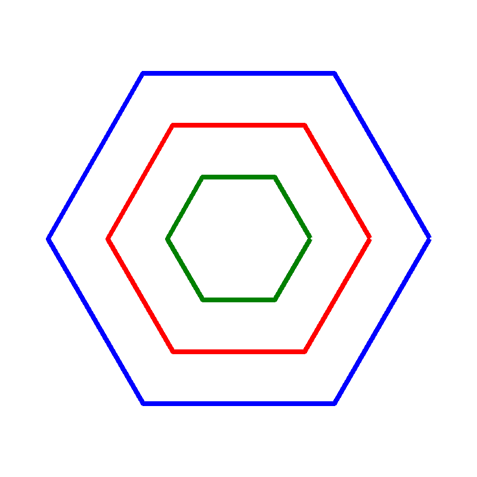

# Lục Giác Tổ Ong Đồng Tâm

## Bối cảnh

Cấu trúc tổ ong thiên nhiên gồm các hình lục giác đều lồng khít vào nhau cực kỳ vững chắc.

## Nhiệm vụ

Lập trình vẽ N hình lục giác đều lồng nhau từ cạnh lớn đến cạnh nhỏ.

## Kịch bản tương tác (Input Scenario)

- Nhập kích thước cạnh ngoài cùng.

## Kết quả mong đợi (Expected Behavior / Output)

- Mô hình tổ ong hình học tinh xảo.

## Hình ảnh minh họa kết quả mẫu

## Sample 1

### Kịch bản chạy trên sân khấu

- **Thao tác khởi động:** Nhập kích thước cạnh ngoài cùng.

- **Kết quả hình ảnh:** Mô hình tổ ong hình học tinh xảo.

### Giải thích

Cạnh lục giác giảm dần 15 bước sau mỗi tầng.

## Ràng buộc

- Môi trường: Scratch 3.0 với phần mở rộng Bút vẽ (Pen).

- Tọa độ khởi tạo an toàn trong khung hình sân khấu (x: -240 đến 240, y: -180 đến 180).

- Nguồn bài thi: Trích xuất từ tài liệu chuẩn `Câu 58 - CHỦ ĐỀ VẼ HÌNH TRÊN SCRATCH.docx`.
