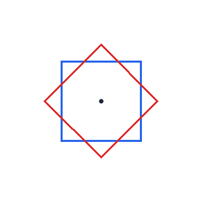

# Ngôi Sao 8 Cánh Nghệ Thuật

## Bối cảnh

Họa tiết hoa văn trống đồng và la bàn hàng hải với ngôi sao 8 cánh cân đối.

## Nhiệm vụ

Ghép 2 hình vuông xoay góc 45 độ hoặc ghép 8 hình tam giác nhọn quanh tâm.

## Kịch bản tương tác (Input Scenario)

- Khởi động khi người dùng nhấn vào biểu tượng **Cờ Xanh**.

- Không yêu cầu nhập dữ liệu từ bàn phím.

## Kết quả mong đợi (Expected Behavior / Output)

- Biểu tượng la bàn ngôi sao 8 cánh.

## Hình ảnh minh họa kết quả mẫu

## Sample 1

### Kịch bản chạy trên sân khấu

- **Thao tác khởi động:** Nhấn cờ xanh.

- **Kết quả hình ảnh:** Biểu tượng la bàn ngôi sao 8 cánh.

### Giải thích

Vẽ hình vuông 1, xoay phải 45 độ, vẽ hình vuông 2.

## Ràng buộc

- Môi trường: Scratch 3.0 với phần mở rộng Bút vẽ (Pen).

- Tọa độ khởi tạo an toàn trong khung hình sân khấu (x: -240 đến 240, y: -180 đến 180).

- Nguồn bài thi: Trích xuất từ tài liệu chuẩn `Câu 18, 50 - CHỦ ĐỀ VẼ HÌNH TRÊN SCRATCH.docx`.
