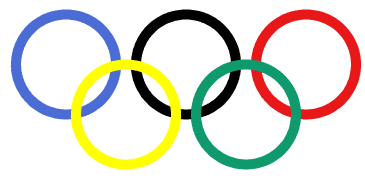

# Biểu Tượng 5 Vòng Tròn Olympic

## Bối cảnh

Logo Thế vận hội Olympic gồm 5 vòng tròn đan xen nhau đại diện cho 5 châu lục: Xanh lam, Vàng, Đen, Xanh lá, Đỏ.

## Nhiệm vụ

Lập trình vẽ chính xác 5 vòng tròn nét to (size = 10) tại các tọa độ chuẩn xác lồng vào nhau.

## Kịch bản tương tác (Input Scenario)

- Khởi động khi người dùng nhấn vào biểu tượng **Cờ Xanh**.

- Không yêu cầu nhập dữ liệu từ bàn phím.

## Kết quả mong đợi (Expected Behavior / Output)

- Logo Olympic hoàn chỉnh đúng chuẩn quốc tế.

## Hình ảnh minh họa kết quả mẫu

## Sample 1

### Kịch bản chạy trên sân khấu

- **Thao tác khởi động:** Nhấn cờ xanh.

- **Kết quả hình ảnh:** Logo Olympic hoàn chỉnh đúng chuẩn quốc tế.

### Giải thích

3 vòng hàng trên, 2 vòng so le hàng dưới.

## Ràng buộc

- Môi trường: Scratch 3.0 với phần mở rộng Bút vẽ (Pen).

- Tọa độ khởi tạo an toàn trong khung hình sân khấu (x: -240 đến 240, y: -180 đến 180).

- Nguồn bài thi: Trích xuất từ tài liệu chuẩn `Câu 12 - CHỦ ĐỀ VẼ HÌNH TRÊN SCRATCH.docx`.
