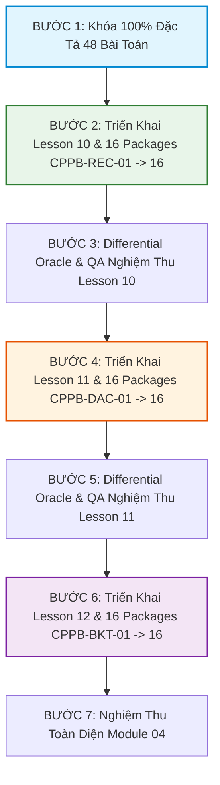

# MASTER MODULE 04 DESIGN: THUẬT TOÁN ĐỆ QUY, CHIA ĐỂ TRỊ & QUAY LUI
*(Curriculum Architecture v2 — Gold Standard for iKHEDU C++ Competitive Programming)*

---

## 1. Mục Tiêu & Cầu Nối Sư Phạm (Pedagogical Bridge)

Module 04 đánh dấu bước chuyển mình mang tính bước ngoặt trong tư duy giải quyết vấn đề của học sinh: **Từ tư duy tuần tự tuyến tính (`for`, `while`) sang tư duy phân rã bài toán, quản lý cây gọi hàm và khám phá không gian trạng thái.**

```text
TƯ DUY TUẦN TỰ (Module 01 - 03)
      │
      ▼
ĐỆ QUY & CÂY GỌI HÀM (Lesson 10)
"Hàm tự gọi lại chính nó, quản lý Call Stack, Winding & Unwinding Phase"
      │
      ▼
CHIA ĐỂ TRỊ (Lesson 11)
"Chia bài toán lớn thành các bài toán con độc lập (Divide → Solve → Combine)"
      │
      ▼
QUAY LUI & NHÁNH CẬN (Lesson 12)
"Khám phá không gian trạng thái: Feasibility Pruning vs Optimality Pruning"
      │
      ▼
QUY HOẠCH ĐỘNG (Module 05)
"Nhận diện Overlapping Subproblems từ Đệ Quy để lưu bảng nhớ (Memoization / DP)"
```

---

## 2. Ranh Giới Công Cụ & Hợp Đồng Sư Phạm (Tool & Pedagogical Contract)

* **ĐƯỢC PHÉP SỬ DỤNG TRONG MODULE 04:**
  * Khái niệm Call Stack, Stack Frame, Base Case, Recursive Case, Winding Phase (trước khi gọi đệ quy), Unwinding Phase (khi hàm return).
  * Đệ quy tuyến tính, đệ quy nhị phân (Binary Recursion), đệ quy cây.
  * Kỹ thuật Chia để trị (`Divide` $\to$ `Solve` $\to$ `Combine`), Merge Sort, Đếm cặp nghịch thế $\mathcal{O}(N \log N)$.
  * Kỹ thuật Quay lui chuẩn (`Choose` $\to$ `Explore` $\to$ `Unchoose`).
  * Nhánh cận (Branch & Bound): Phân biệt rõ **Feasibility Pruning** (cắt nhánh do vi phạm ràng buộc nghiệm) vs **Optimality Pruning** (cắt nhánh do hàm đánh giá bound không thể tốt hơn nghiệm tối ưu hiện có).
* **TUYỆT ĐỐI CHƯA DÙNG (NOT YET BOUNDARY):**
  * **Cấm dùng Memoization / Bảng nhớ `dp[]`:** Học sinh phải thấy được sự bùng nổ hàm mũ khi trạng thái bị trùng lặp (ví dụ bài Fibonacci $2^N$) để làm tiền đề cho Module 05.
  * **Cấm dùng Bitmask DP, Meet-in-the-middle.**
  * **Cấm dùng cấu trúc cây nâng cao:** Segment Tree, Fenwick Tree.
* **QUY TẮC C++ TAIL RECURSION & STACK SAFETY:**
  * `Tail recursion ≠ Guaranteed Stack Optimization in C++`: Ngôn ngữ C++ không đảm bảo trình biên dịch luôn tối ưu tail-call. Độ sâu đệ quy phụ thuộc kích thước stack frame, biến cục bộ, compiler flags và hệ điều hành. Học sinh phải luôn đánh giá độ sâu stack để tránh tràn bộ nhớ (Stack Overflow / SIGSEGV).

---

## 3. Ma Trận Testcase Theo Phân Loại Bài Toán

Bộ testcase của mỗi bài toán ($\ge 20$ tests) phải được thiết kế linh hoạt dựa trên đặc thù bài toán:
* **Minimal / Sample:** 2 - 3 tests ($N = 1, N = 0$, biên nhỏ nhất).
* **Basic / Functional:** 4 - 6 tests (các trường hợp tổng quát).
* **Boundary & Edge Cases:** 3 - 4 tests (dãy tăng dần, giảm dần, toàn phần tử bằng nhau, chuỗi đối xứng, nghiệm rỗng).
* **Adversarial / Tree Degeneration:** 3 - 4 tests (cây suy biến sâu nhất, bẫy rẽ nhánh cực đại).
* **Stress Test:** 2 - 3 tests (quy mô tối đa để kiểm tra Time Limit và Memory Limit).

---

## 4. Hệ Thống Đánh Giá Kép: Brute-Force & Pedagogical Oracle

Để đảm bảo chất lượng học liệu đỉnh cao:
1. **Brute-Force Oracle (`oracle_brute.cpp`):** Viết lời giải duyệt trâu độc lập và script đối chiếu kết quả ngẫu nhiên với `solution.cpp` trước khi xuất testcase.
2. **Pedagogical Oracle (Kiểm định chuẩn sư phạm):**
   * *Yêu cầu bắt buộc:* Solution phải cài đặt đúng thuật toán của chuyên đề (Ví dụ: bài Merge Sort bắt buộc tự viết hàm `merge()`, không được gọi `sort()`; bài Quay lui bắt buộc cài đặt hàm đệ quy chọn/hoàn tác, không được gọi `next_permutation()`).
   * *Cấm kỵ:* Solution không được dùng kỹ thuật vượt cấp (DP/Memoization) làm mất đi ý nghĩa sư phạm của bài toán.

---

## 5. Đặc Tả Chi Tiết 48 Bài Toán Module 04 ($P0 \to P5$)

### 5.1. LESSON 10: ĐỆ QUY CĂN BẢN & CÂY GỌI HÀM (16 Bài `CPPB-REC-01` $\to$ `16`)

| Mã Bài | Tên Bài Toán | Level | Phân Loại | Kỹ Năng / Required | Time Complexity | Stack Space | Max Depth | Oracle Strategy |
|---|---|:---:|:---:|---|:---:|:---:|:---:|---|
| `CPPB-REC-01` | **In Dãy Số $1 \dots N$ và $N \dots 1$** | `P0` | **Core** | Winding vs Unwinding order | $\Theta(N)$ | $\Theta(N)$ | $N$ | So sánh với vòng lặp |
| `CPPB-REC-02` | **Tính Tổng Dãy Số & Giai Thừa $N!$** | `P0` | **Core** | Return value accumulator | $\Theta(N)$ | $\Theta(N)$ | $N$ | So sánh với vòng lặp |
| `CPPB-REC-03` | **Đếm & Tính Tổng Chữ Số Của $N$** | `P1` | **Core** | $N / 10$ & $N \% 10$ | $\Theta(\log_{10} N)$ | $\Theta(\log_{10} N)$ | $\le 19$ | So sánh với phép chia lặp |
| `CPPB-REC-04` | **Đảo Ngược Mảng Bằng Đệ Quy** | `P1` | **Core** | Đệ quy 2 con trỏ `(l, r)` | $\Theta(N)$ | $\Theta(N)$ | $N/2$ | So sánh với `reverse()` |
| `CPPB-REC-05` | **Kiểm Tra Chuỗi Palindrome** | `P1` | **Core** | Co hẹp biên `(l+1, r-1)` | $\Theta(\|S\|)$ | $\Theta(\|S\|)$ | $\|S\|/2$ | So sánh với 2 con trỏ |
| `CPPB-REC-06` | **So Sánh Tuyến Tính & Chia Đôi (Min/Max)**| `P2` | **Core** | Linear vs Binary Rec | $\Theta(N)$ | $\Theta(\log N)$ | $\log_2 N$ | So sánh với duyệt tuần tự |
| `CPPB-REC-07` | **Thuật Toán Euclid Tính $\gcd(A, B)$** | `P2` | **Core** | Đệ quy `gcd(b, a % b)` | $\Theta(\log(\min))$ | $\Theta(\log(\min))$ | $\le 90$ | So sánh với Euclid lặp |
| `CPPB-REC-08` | **Lũy Thừa Đệ Quy $A^B \pmod M$** | `P2` | **Core** | Binary Exponentiation Rec | $\Theta(\log B)$ | $\Theta(\log B)$ | $\log_2 B$ | So sánh với lũy thừa lặp |
| `CPPB-REC-09` | **Tháp Hà Nội (Tower of Hanoi)** | `P3` | **Core** | Cây gọi hàm 2 nhánh $2^N - 1$ | $\Theta(2^N)$ | $\Theta(N)$ | $N$ | So sánh với mô phỏng bit |
| `CPPB-REC-10` | **Dãy Fibonacci Đệ Quy & Cây Phân Nhánh** | `P3` | **Core** | Phân tích Overlapping States | $\Theta(\varphi^N)$ | $\Theta(N)$ | $N$ | So sánh với mảng lặp $F[i]$ |
| `CPPB-REC-11` | **Chuyển Đổi Hệ Cơ Số $10 \to 2$** | `P3` | **Core** | In tự nhiên khi Unwind | $\Theta(\log_2 N)$ | $\Theta(\log_2 N)$ | $\le 60$ | So sánh với `bitset` |
| `CPPB-REC-12` | **Xây Dựng Hệ Thức Truy Hồi Dãy Số** | `P3` | **Core** | Recurrence: $S(N) = S(N-1) + \dots$ | $\Theta(N)$ | $\Theta(N)$ | $N$ | So sánh với vòng lặp |
| `CPPB-REC-13` | **Tháp Hà Nội Có Ràng Buộc Nước Đi** | `P4` | *Advanced* | Lập hệ thức truy hồi $3^N - 1$ | $\Theta(3^N)$ | $\Theta(N)$ | $N$ | Mô phỏng đệ quy 3 nhánh |
| `CPPB-REC-14` | **Sinh Xâu Nhị Phân Không 2 Số 1 Liền Kề**| `P4` | *Advanced* | Recurrence State Generation | $\Theta(F_{N+2})$ | $\Theta(N)$ | $N$ | So sánh với duyệt nhị phân |
| `CPPB-REC-15` | **Đếm Phân Hoạch Nguyên Của N Không Thứ Tự**| `P4` | *Extension*| Pure Recursive Recurrence | $\Theta(\text{Exp})$ | $\Theta(N)$ | $N$ | So sánh với DP brute |
| `CPPB-REC-16` | **Đếm Cây Nhị Phân Có Thứ Tự (Catalan Rec)**| `P5` | *Extension*| Cây đệ quy không sinh trùng | $\Theta(\text{Catalan})$| $\Theta(N)$ | $N$ | Brute Force Enumeration |

---

### 5.2. LESSON 11: KỸ THUẬT CHIA ĐỂ TRỊ (16 Bài `CPPB-DAC-01` $\to$ `16`)

| Mã Bài | Tên Bài Toán | Level | Phân Loại | Kỹ Năng / Required | Time Complexity | Call Stack | Aux Memory | Max Depth | Oracle Strategy |
|---|---|:---:|:---:|---|:---:|:---:|:---:|:---:|---|
| `CPPB-DAC-01` | **Tìm Kiếm Nhị Phân Bằng Đệ Quy (Cầu Nối D&C)**| `P0` | **Core** | Single-branch D&C Interval | $\Theta(\log N)$ | $\Theta(\log N)$ | $\mathcal{O}(1)$ | $\log_2 N$ | So sánh với duyệt tuần tự |
| `CPPB-DAC-02` | **Range Minimum Query (RMQ) Chia Để Trị** | `P0` | **Core** | Multi-node interval tree exploration | $\Theta(N)$ | $\Theta(\log N)$ | $\mathcal{O}(1)$ | $\log_2 N$ | So sánh với `min_element` |
| `CPPB-DAC-03` | **Tìm Phần Tử Lớn Thứ Hai (Tournament Tree)**| `P1` | **Core** | $N + \log_2 N - 2$ so sánh ($N=2^k$) | $\Theta(N)$ | $\Theta(\log N)$ | $\Theta(\log N)$ | $\log_2 N$ | So sánh với `sort` |
| `CPPB-DAC-04` | **Gộp Hai Mảng Đã Sắp Xếp (Merge Step)** | `P1` | **Core** | 2 con trỏ gộp mảng tăng dần | $\Theta(N + M)$ | $\mathcal{O}(1)$ | $\mathcal{O}(1)$ | $1$ | So sánh với gộp mảng `sort` |
| `CPPB-DAC-05` | **Thuật Toán Sắp Xếp Trộn (Merge Sort)** | `P2` | **Core** | D&C Sort + Reusable Buffer | $\Theta(N \log N)$ | $\Theta(\log N)$ | $\Theta(N)$ | $\log_2 N$ | So sánh với `std::sort` |
| `CPPB-DAC-06` | **Đếm Số Cặp Nghịch Thế (Inversion Count)** | `P2` | **Core** | Inversion counting while merging | $\Theta(N \log N)$ | $\Theta(\log N)$ | $\Theta(N)$ | $\log_2 N$ | So sánh với 2 vòng `for` $\mathcal{O}(N^2)$ |
| `CPPB-DAC-07` | **Đoạn Con Tổng Lớn Nhất (Maximum Subarray)** | `P2` | **Core** | `max(Left, Right, Crossing)` | $\Theta(N \log N)$ | $\Theta(\log N)$ | $\mathcal{O}(1)$ | $\log_2 N$ | So sánh với thuật toán Kadane |
| `CPPB-DAC-08` | **Tìm Phần Tử Đa Số (Majority Element) D&C** | `P2` | **Core** | D&C Majority Voting | $\Theta(N \log N)$ | $\Theta(\log N)$ | $\mathcal{O}(1)$ | $\log_2 N$ | So sánh với đếm phân phối `map` |
| `CPPB-DAC-09` | **Lũy Thừa Ma Trận Chia Để Trị $2 \times 2$** | `P3` | **Core** | Matrix Binary Exponentiation | $\Theta(\log N)$ | $\Theta(\log N)$ | $\mathcal{O}(1)$ | $\log_2 N$ | So sánh với nhân ma trận lặp |
| `CPPB-DAC-10` | **Tìm Điểm Cực Đại Mảng Unimodal (Peak Index)**| `P3` | **Core** | Ternary/Binary Search on Peak | $\Theta(\log N)$ | $\Theta(\log N)$ | $\mathcal{O}(1)$ | $\log_2 N$ | So sánh với duyệt tuần tự |
| `CPPB-DAC-11` | **Tính Tổng Cấp Số Nhân D&C** | `P3` | **Core** | $S(2k+1) = S(k) \times (1 + A^{k+1})$ | $\Theta(\log N)$ | $\Theta(\log N)$ | $\mathcal{O}(1)$ | $\log_2 N$ | So sánh với vòng lặp tuần tự |
| `CPPB-DAC-12` | **Đếm Số Cặp $A_i > 2A_j$ (Significant Inversions)**| `P3` | **Core** | 2-pointer count before merge | $\Theta(N \log N)$ | $\Theta(\log N)$ | $\Theta(N)$ | $\log_2 N$ | So sánh với vét cạn $\mathcal{O}(N^2)$ |
| `CPPB-DAC-13` | **Thuật Toán QuickSelect Tìm K-th Element** | `P4` | *Advanced* | D&C Partition Selection | $\Theta(N) \text{ avg}$ | $\Theta(\log N)$ | $\mathcal{O}(1)$ | $\log_2 N$ | So sánh với `std::sort` |
| `CPPB-DAC-14` | **Đếm Số Đoạn Con Tổng Trong Đoạn $[L, R]$**| `P4` | *Advanced* | Prefix Sum Merge Count | $\Theta(N \log N)$ | $\Theta(\log N)$ | $\Theta(N)$ | $\log_2 N$ | So sánh với vét cạn $\mathcal{O}(N^2)$ |
| `CPPB-DAC-15` | **Cặp Điểm Gần Nhất (Closest Pair of Points)**| `P4` | *Challenge* | D&C Strip Scanning $\le 7$ pts | $\Theta(N \log N)$ | $\Theta(\log N)$ | $\Theta(N)$ | $\log_2 N$ | So sánh với vét cạn $\mathcal{O}(N^2)$ |
| `CPPB-DAC-16` | **Median Của Hai Mảng Đã Sắp Xếp** | `P5` | *Challenge* | D&C Binary Partition Selection | $\Theta(\log(\min))$ | $\Theta(\log(\min))$ | $\mathcal{O}(1)$ | $\log_2(\min)$ | So sánh với gộp mảng `std::merge` |

---

### 5.3. LESSON 12: THUẬT TOÁN QUAY LUI & NHÁNH CẬN (16 Bài `CPPB-BKT-01` $\to$ `16`)

| Mã Bài | Tên Bài Toán | Level | Phân Loại | Kỹ Năng / Required | Output / Time Complexity | Search Space | Call Stack | Max Depth | Oracle Strategy |
|---|---|:---:|:---:|---|:---:|:---:|:---:|:---:|---|
| `CPPB-BKT-01` | **Sinh Xâu Nhị Phân Độ Dài $N$** | `P0` | **Core** | Choose-Explore-Unchoose Pattern | $\Theta(N \cdot 2^N)$ | $2^N$ nghiệm | $\Theta(N)$ | $N$ | So sánh bitmask duyệt |
| `CPPB-BKT-02` | **Sinh Tập Con Của Tập $N$ Phần Tử** | `P0` | **Core** | Nhánh chọn / bỏ qua | $\Theta(N \cdot 2^N)$ | $2^N$ tập con | $\Theta(N)$ | $N$ | So sánh bitmask duyệt |
| `CPPB-BKT-03` | **Sinh Hoán Vị $1 \dots N$** | `P1` | **Core** | Đánh dấu `visited[]` hoán vị | $\Theta(N \cdot N!)$ | $N!$ hoán vị | $\Theta(N)$ | $N$ | `std::next_permutation` |
| `CPPB-BKT-04` | **Sinh Tổ Hợp Chập $K$ Của $N$** | `P1` | **Core** | Đệ quy tăng dần `start_val` | $\Theta(K \cdot C_N^K)$ | $C_N^K$ tổ hợp | $\Theta(K)$ | $K$ | Vét cạn lặp $K$ vòng |
| `CPPB-BKT-05` | **Sinh Dãy Ngoặc Hợp Lệ Độ Dài $2N$** | `P1` | **Core** | Cắt tỉa `open < N` & `close < open` | $\Theta(N \cdot \text{Catalan})$| $\text{Catalan}(N)$ | $\Theta(N)$ | $2N$ | So sánh với sinh nhị phân |
| `CPPB-BKT-06` | **Bài Toán $N$-Queens (Đếm Số Cách)** | `P2` | **Core** | Đánh dấu `col`, `diag1`, `diag2` | $\mathcal{O}(N!)$ | $\le N!$ | $\Theta(N)$ | $N$ | Hardcode mảng nghiệm |
| `CPPB-BKT-07` | **Mê Cung (Rat in a Maze)** | `P2` | **Core** | Đánh dấu 4 hướng `D < L < R < U` | $\mathcal{O}(4^{N^2})$ loose | $\le 4^{N^2}$ | $\Theta(N^2)$ | $N^2$ | Duyệt DFS có hoàn tác |
| `CPPB-BKT-08` | **Tập Con Có Tổng Bằng $S$ (Subset Sum)** | `P2` | **Core** | Cắt tỉa `current_sum + A[i] > S` | $\mathcal{O}(2^N)$ | $\le 2^N$ | $\Theta(N)$ | $N$ | Duyệt bitmask |
| `CPPB-BKT-09` | **Chia Tập Thành 2 Phần Bằng Nhau** | `P3` | **Core** | Tìm tập con tổng $S/2$ + prune | $\mathcal{O}(2^N)$ | $\le 2^N$ | $\Theta(N)$ | $N$ | Duyệt bitmask |
| `CPPB-BKT-10` | **Đổi Tiền Xu Ít Nhất (B&B Coin Change)** | `P3` | **Core** | Lower Bound: `remain / c[0]` | Exponential worst | Bound Pruned | $\Theta(S)$ | $S$ | Quy hoạch động knapsack |
| `CPPB-BKT-11` | **Mã Đi Tuần (Knight's Tour)** | `P3` | **Core** | Heuristic Warnsdorff ordering | $\mathcal{O}(8^{N^2})$ loose | Warnsdorff Tree | $\Theta(N^2)$ | $N^2$ | Quay lui độc lập |
| `CPPB-BKT-12` | **Trò Chơi Sudoku $9 \times 9$** | `P3` | **Core** | CSP Backtracking hàng/cột/box | $\mathcal{O}(9^E)$ ($E \le 81$) | $\le 9^E$ | $\mathcal{O}(E)$ | $E \le 81$ | Solver độc lập |
| `CPPB-BKT-13` | **Bài Toán Cái Túi $0/1$ Nhánh Cận (B&B)**| `P4` | *Advanced* | Upper Bound: Fractional Knapsack | Exponential worst | Bound Pruned | $\Theta(N)$ | $N$ | Duyệt bitmask $2^N$ |
| `CPPB-BKT-14` | **Người Du Lịch (TSP) Nhánh Cận** | `P4` | *Advanced* | Lower Bound: `(N - k) * min_edge` | $\mathcal{O}(N!)$ worst | Bound Pruned | $\Theta(N)$ | $N$ | `std::next_permutation` |
| `CPPB-BKT-15` | **Tô Màu Đồ Thị (Graph $K$-Coloring)** | `P4` | *Challenge* | CSP Backtracking kề khác màu | $\mathcal{O}(K^V)$ | $\le K^V$ | $\Theta(V)$ | $V$ | Vét cạn $K^V$ |
| `CPPB-BKT-16` | **Phân Công Công Việc Tối Ưu (Job Assign)**| `P5` | *Challenge* | Lower Bound: tổng `min_row` | $\mathcal{O}(N!)$ worst | Bound Pruned | $\Theta(N)$ | $N$ | `std::next_permutation` |

---

## 6. Lộ Trình Triển Khai Tuần Tự (Execution Workflow)

Để bảo đảm kiểm soát chất lượng tuyệt đối và tránh lỗi hàng loạt, toàn bộ Module 04 được triển khai theo chu trình khép kín từng Lesson:


