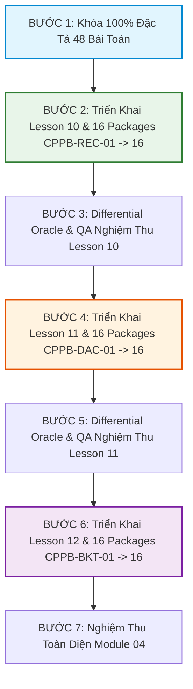

# MODULE 04 ALGORITHMIC AUDIT & PROBLEM SPECIFICATION FREEZE
*(Tài Liệu Kiểm Định Thuật Toán, Ranh Giới Sư Phạm & Khóa Đặc Tả 48 Bài Toán Module 04)*

---

## 1. Tuyên Ngôn Kiến Trúc & Kiểm Định Sư Phạm (Auditing Philosophy)

> **"AC ≠ Curriculum Correctness"**  
> Một bài nộp đạt điểm tối đa (Accepted) trên Online Judge vẫn có thể bị coi là **thất bại về mặt sư phạm** nếu giải thuật sử dụng các hàm thư viện tắt (`std::sort`, `next_permutation`, `std::nth_element`) hoặc sử dụng kỹ thuật vượt cấp (Quy hoạch động, Memoization) làm triệt tiêu mục tiêu rèn luyện tư duy cốt lõi của bài học.

### Ba Trụ Cột Đánh Giá Chất Lượng:
1. **Functional Correctness:** Tính đúng đắn của output trên 100% testcases, không Runtime Error, không UB (Undefined Behavior).
2. **Pedagogical Integrity (Structural Oracle):** Lời giải bắt buộc tuân thủ đúng paradigm tư duy của bài (tự cài đặt hàm đệ quy, tự chia đôi và gộp mảng `merge()`, tự cài đặt cây trạng thái quay lui và hàm cắt tỉa `prune()`).
3. **Complexity & Stack Safety:** Không giả định một ngưỡng Stack cố định; luôn đánh giá độ sâu đệ quy và kích thước stack frame thực tế để triệt tiêu nguy cơ Stack Overflow.

---

## 2. Rà Soát & Tinh Chỉnh Ranh Giới Nội Dung (Scope Refinement)

### 🔹 Loại Bỏ Các Nội Dung Quá Tải / ROI Thấp (Pruned Topics):
* ❌ **Thuật toán Strassen (Lesson 11):** Chuyển sang *Góc Kiến Thức Mở Rộng*. Thay bằng **Đếm Đoạn Con Thỏa Mãn Tính Chất Chia Để Trị** (High ROI cho HSG).
* ❌ **Bao Lồi Chia Để Trị (Lesson 11):** Quá nặng về hình học tính toán (Orientation, Tangents). Thay bằng **Cặp Điểm Gần Nhất (Closest Pair $\mathcal{O}(N \log N)$)** làm đỉnh cao D&C hình học.
* ❌ **Ma Phương Magic Square (Lesson 12):** Quá thiên về giải đố (Puzzle). Thay bằng **Bài Toán Phân Công / Xếp Lịch Tối Ưu Bằng Branch & Bound** (Sát đề thi HSG/Chuyên Tin).

---

## 3. Khóa Chi Tiết 16 Bài Toán Lesson 10 (Recursion & Call Stack)

### `CPPB-REC-01`: In Dãy Số $1 \dots N$ và $N \dots 1$
* **Mục tiêu sư phạm:** Hiểu sự khác biệt giữa **Winding Phase** (in trước khi gọi đệ quy $\to$ thứ tự $N \dots 1$) và **Unwinding Phase** (in sau khi gọi đệ quy $\to$ thứ tự $1 \dots N$).
* **Đặc tả:** Cho số nguyên $N$. In ra 2 dòng: dòng 1 in $1 \dots N$, dòng 2 in $N \dots 1$.
* **Ràng buộc:** $1 \le N \le 1000$.
* **Required:** 2 hàm đệ quy riêng biệt (`printForward(n)` và `printBackward(n)`).
* **Forbidden:** Vòng lặp `for`, `while`, mảng phụ trợ.
* **Complexity:** Time $\mathcal{O}(N)$, Space $\mathcal{O}(N)$ stack frames.
* **Edge cases:** $N = 1$.
* **Oracle:** Đối chiếu với vòng lặp `for`.

### `CPPB-REC-02`: Tính Tổng Dãy Số & Giai Thừa $N!$
* **Mục tiêu:** Hiểu cơ chế tích lũy giá trị trả về (`return n + f(n - 1)` và `return 1LL * n * fact(n - 1)`).
* **Đặc tả:** Cho $N$. Tính $S = 1 + 2 + \dots + N$ và $P = N!$.
* **Ràng buộc:** $1 \le N \le 20$.
* **Required:** Hàm đệ quy có giá trị trả về kiểu `long long`.
* **Forbidden:** `for`, `while`, công thức đóng $N(N+1)/2$ trong solution chính.
* **Complexity:** Time $\mathcal{O}(N)$, Space $\mathcal{O}(N)$ stack.
* **Edge cases:** $N = 1, N = 20$.
* **Oracle:** Đối chiếu công thức lặp.

### `CPPB-REC-03`: Đếm Số Lượng & Tính Tổng Chữ Số Của $N$
* **Mục tiêu:** Rèn luyện phép phân rã số học $N / 10$ và $N \% 10$ trên cấu trúc đệ quy.
* **Đặc tả:** Cho số nguyên dương $N$. Đếm số chữ số và tính tổng các chữ số của $N$.
* **Ràng buộc:** $1 \le N \le 10^{18}$.
* **Required:** Đệ quy trên kiểu `long long`.
* **Forbidden:** Ép kiểu chuỗi `to_string()`, vòng lặp.
* **Complexity:** Time $\mathcal{O}(\log_{10} N)$, Space $\mathcal{O}(\log_{10} N)$ stack (tối đa $\le 19$ frames, an toàn tuyệt đối).
* **Edge cases:** $N \le 9$, $N = 10^{18}$.
* **Oracle:** Đối chiếu vòng lặp `while (n > 0)`.

### `CPPB-REC-04`: Đảo Ngược Mảng Bằng Đệ Quy
* **Mục tiêu:** Mô hình đệ quy hai con trỏ co hẹp phạm vi $(l+1, r-1)$.
* **Đặc tả:** Đảo ngược mảng $A$ gồm $N$ phần tử.
* **Ràng buộc:** $1 \le N \le 1000$.
* **Required:** Hàm `void reverseRec(vector<long long> &a, int l, int r)` hoán đổi `swap(a[l], a[r])` rồi đệ quy `reverseRec(a, l + 1, r - 1)`.
* **Forbidden:** `std::reverse`, vòng lặp `for/while`.
* **Complexity:** Time $\Theta(N)$, Stack Space $\Theta(N)$, Max Depth $N/2$.
* **Edge cases:** $N = 1, N = 2$, mảng đã đối xứng.
* **Oracle:** `std::reverse`.

### `CPPB-REC-05`: Kiểm Tra Chuỗi Palindrome Bằng Đệ Quy
* **Mục tiêu:** Base case kép (nếu $l \ge r \implies \text{true}$; nếu $S[l] \ne S[r] \implies \text{false}$).
* **Đặc tả:** Kiểm tra xâu ký tự $S$ có phải là xâu đối xứng hay không.
* **Ràng buộc:** $1 \le |S| \le 1000$.
* **Required:** Hàm `bool isPalindrome(const string &s, int l, int r)`.
* **Forbidden:** Đảo chuỗi so sánh, vòng lặp.
* **Complexity:** Time $\Theta(|S|)$, Stack Space $\Theta(|S|)$, Max Depth $|S|/2$.
* **Edge cases:** $|S| = 1, |S| = 2$, xâu lệch đúng ký tự ở giữa hoặc ký tự đầu/cuối.
* **Oracle:** Duyệt 2 con trỏ lặp.
* **Ràng buộc:** $1 \le N \le 1000, |A_i| \le 10^9$.
* **Required:** Hàm chia đôi `getMin(l, r) = min(getMin(l, mid), getMin(mid + 1, r))`.
* **Forbidden:** `std::min_element`, vòng lặp.
* **Complexity:** Time $\Theta(N)$, Stack Space $\Theta(\log N)$, Max Depth $\log_2 N$.
* **Edge cases:** $N = 1$, tất cả phần tử bằng nhau, mảng giảm dần.
* **Oracle:** Quét tuần tự `for`.

### `CPPB-REC-07`: Thuật Toán Euclid Tính $\gcd(A, B)$ Bằng Đệ Quy
* **Mục tiêu:** Hiểu bản chất biến đổi đồng dư và độ co hẹp logarithmic của Euclid.
* **Đặc tả:** Tính $\gcd(A, B)$ và $\text{lcm}(A, B)$.
* **Ràng buộc:** $1 \le A, B \le 10^{18}$.
* **Required:** Hàm `long long gcd(long long a, long long b) { return b == 0 ? a : gcd(b, a % b); }`.
* **Forbidden:** `std::gcd`, `__gcd`.
* **Complexity:** Time $\mathcal{O}(\log(\min(A, B)))$, Space $\mathcal{O}(\log(\min(A, B)))$ stack.
* **Edge cases:** $A = B, A = 1, B = 10^{18}$, hai số Fibonacci liên tiếp (trường hợp xấu nhất).
* **Oracle:** Thuật toán Euclid lặp `while (b > 0)`.

### `CPPB-REC-08`: Lũy Thừa Đệ Quy $A^B \pmod M$
* **Mục tiêu:** Phân tích độ phức tạp thời gian từ $\mathcal{O}(B)$ tuyến tính giảm xuống $\mathcal{O}(\log B)$ nhị phân (vẫn là đệ quy tuyến tính 1 nhánh gọi).
* **Đặc tả:** Tính $A^B \pmod M$.
* **Ràng buộc:** $0 \le A, B \le 10^{18}, 1 \le M \le 10^9$.
* **Required:** Đệ quy nhị phân `power(a, b/2)` một lần duy nhất lưu vào biến tạm `half` để tránh tính lại.
* **Forbidden:** Gọi đệ quy 2 lần `power(a, b/2) * power(a, b/2)` (gây nổ $\Theta(B)$), `pow()`.
* **Complexity:** Time $\mathcal{O}(\log B)$, Space $\mathcal{O}(\log B)$ stack.
* **Edge cases:** $B = 0, B = 1, A = 0$.
* **Oracle:** Lũy thừa nhị phân lặp.

### `CPPB-REC-09`: Bài Toán Tháp Hà Nội (Tower of Hanoi)
* **Mục tiêu:** Cây gọi hàm 2 nhánh kinh điển: $T(N) = 2T(N-1) + 1 \implies \Theta(2^N)$ bước di chuyển chính xác $2^N - 1$.
* **Đặc tả:** In ra các bước chuyển $N$ đĩa từ cọc $A$ sang cọc $C$ qua cọc trung gian $B$.
* **Ràng buộc:** $1 \le N \le 15$.
* **Required:** Hàm `hanoi(n, a, c, b)` gồm 3 bước: `hanoi(n-1, a, b, c)`, in nước đi, `hanoi(n-1, b, c, a)`.
* **Complexity:** Time $\Theta(2^N)$, Space $\mathcal{O}(N)$ stack.
* **Edge cases:** $N = 1, N = 2$.
* **Oracle:** Mô phỏng Gray Code / Bitwise Hanoi.

### `CPPB-REC-10`: Dãy Fibonacci Đệ Quy & Cây Gọi Hàm Phân Nhánh
* **Mục tiêu:** Khảo sát cây nhị phân gọi hàm, chứng minh số phép tính tăng theo $\Theta(\varphi^N)$ và trùng lặp trạng thái (Overlapping Subproblems) — chuẩn bị cầu nối sang Dynamic Programming.
* **Đặc tả:** Tính số Fibonacci $F_N$ bằng công thức đệ quy thuần túy $F_N = F_{N-1} + F_{N-2}$ và đếm tổng số lần hàm `fib()` được gọi.
* **Ràng buộc:** $0 \le N \le 30$.
* **Required:** Hàm đệ quy thuần túy đếm biến toàn cục `call_count++`.
* **Forbidden:** Lưu mảng nhớ `memo[]`, mảng DP.
* **Complexity:** Time $\Theta(\varphi^N)$ với $\varphi \approx 1.618$, Space $\mathcal{O}(N)$ stack.
* **Edge cases:** $N = 0, N = 1, N = 30$.
* **Oracle:** Mảng lặp $F[i] = F[i-1] + F[i-2]$ để kiểm tra giá trị.

### `CPPB-REC-11`: Chuyển Đổi Hệ Cơ Số $10 \to 2$ Bằng Đệ Quy
* **Mục tiêu:** Khắc sâu cơ chế in kết quả tự nhiên khi Stack Unwind (in sau lời gọi đệ quy `convert(n / 2)`).
* **Đặc tả:** Chuyển số nguyên dương $N$ sang biểu diễn nhị phân.
* **Ràng buộc:** $1 \le N \le 10^{18}$.
* **Required:** Đệ quy chia $2$, `cout << (n % 2)` sau lời gọi đệ quy.
* **Forbidden:** Chuỗi `string`, mảng phụ trợ, `bitset`.
* **Complexity:** Time $\mathcal{O}(\log_2 N)$, Space $\mathcal{O}(\log_2 N)$ stack.
* **Edge cases:** $N = 1, N = 2^k, N = 2^k - 1$.
* **Oracle:** `std::bitset<64>`.

### `CPPB-REC-12`: Xây Dựng Công Thức Truy Hồi Cho Dãy Số Đan Dấu
* **Mục tiêu:** Rèn luyện kỹ năng thiết lập Recurrence Relation từ bài toán tuần tự: $S(N) = S(N-1) + (-1)^{N+1} N$.
* **Đặc tả:** Cho số $N$, tính $S(N) = 1 - 2 + 3 - 4 + \dots + (-1)^{N+1} N$.
* **Ràng buộc:** $1 \le N \le 1000$.
* **Required:** Cài đặt hàm đệ quy truy hồi $S(N)$.
* **Forbidden:** Vòng lặp `for/while`, công thức đóng.
* **Complexity:** Time $\mathcal{O}(N)$, Space $\mathcal{O}(N)$ stack.
* **Edge cases:** $N = 1, N = 2$, $N$ chẵn, $N$ lẻ.
* **Oracle:** Công thức toán đóng $S(N) = N/2 \times (-1) \dots$

### `CPPB-REC-13`: Tháp Hà Nội Có Ràng Buộc Nước Đi
* **Mục tiêu:** Xây dựng hệ thức truy hồi khi không gian di chuyển bị hạn chế: Không cho phép chuyển trực tiếp $A \leftrightarrow C$, mọi nước đi bắt buộc phải qua cọc trung gian $B$.
* **Đặc tả:** Tìm số bước di chuyển tối thiểu và in lịch trình khi cấm trực tiếp $A \leftrightarrow C$.
* **Recurrence:** Để chuyển $N$ đĩa từ $A \to C$: Chuyển $N-1$ đĩa $A \to C$, chuyển đĩa $N$ từ $A \to B$, chuyển $N-1$ đĩa $C \to A$, chuyển đĩa $N$ từ $B \to C$, chuyển $N-1$ đĩa $A \to C$. Hệ thức: $T(N) = 3T(N-1) + 2 \implies T(N) = 3^N - 1$.
* **Ràng buộc:** $1 \le N \le 10$.
* **Complexity:** Time $\Theta(3^N)$, Space $\mathcal{O}(N)$ stack.
* **Oracle:** Giải thuật đệ quy 3 nhánh độc lập.

### `CPPB-REC-14`: Sinh Xâu Nhị Phân Không Chứa Hai Số 1 Liền Kề
* **Mục tiêu:** Đệ quy phân nhánh có điều kiện ràng buộc cục bộ (Local State Constraint) — tiền đề cho Backtracking.
* **Đặc tả:** Sinh tất cả các xâu nhị phân độ dài $N$ sao cho không có 2 ký tự `'1'` đứng cạnh nhau.
* **Ràng buộc:** $1 \le N \le 20$.
* **Required:** Hàm đệ quy sinh theo tiền tố `gen(prefix, last_bit)`.
* **Complexity:** Số lượng xâu sinh ra bằng $F_{N+2}$ (dãy Fibonacci), Time $\mathcal{O}(F_{N+2})$, Space $\mathcal{O}(N)$.
* **Oracle:** Duyệt nhị phân $0 \dots 2^N-1$ và kiểm tra điều kiện `(x & (x >> 1)) == 0`.

### `CPPB-REC-15`: Đếm Số Cách Phân Tích Số $N$ Thành Tổng (Integer Partitioning)
* **Mục tiêu:** Pure Recursive Recurrence / State Explosion.
* **Đặc tả:** Cho số nguyên $N$. Đếm số cách phân tích $N$ thành tổng các số nguyên dương $N = a_1 + a_2 + \dots + a_k$ với $a_1 \ge a_2 \ge \dots \ge a_k \ge 1$ (không phân biệt thứ tự các số hạng).
* **Ràng buộc:** $1 \le N \le 30$.
* **Required:** Hàm đệ quy `countPartitions(remain, max_val)`:
  $$\text{count}(rem, max\_v) = \text{count}(rem - max\_v, max\_v) + \text{count}(rem, max\_v - 1)$$
* **Forbidden:** Mảng nhớ `dp[][]`, Memoization.
* **Complexity:** Time $\mathcal{O}(\text{Exponential})$ (Partition function $p(N)$, tăng rất nhanh), Space $\mathcal{O}(N)$ stack.
* **Oracle:** Bảng DP chuẩn đối chiếu kết quả.

### `CPPB-REC-16`: Đếm Cây Nhị Phân Có Thứ Tự (Catalan Tree Recurrence)
* **Mục tiêu:** Thiết kế hàm đệ quy cấu trúc cây phân nhánh (Catalan Recurrence) tính số lượng cây nhị phân đúng phân biệt có $N$ nút mà không dùng bảng nhớ để học sinh quan sát cây tính toán.
* **Đặc tả:** Đếm số lượng cây nhị phân tìm kiếm (BST) phân biệt có thể tạo thành từ $N$ khóa có giá trị $1 \dots N$.
* **Recurrence:** Chọn gốc là $i \in [1, N]$, cây con trái có $i - 1$ nút, cây con phải có $N - i$ nút:
  $$C(N) = \sum_{i=1}^N C(i - 1) \times C(N - i)$$
* **Ràng buộc:** $0 \le N \le 15$.
* **Required:** Cài đặt đệ quy hàm Catalan $C(N)$.
* **Forbidden:** `std::set`, `std::map`, công thức đại số $C_{2N}^N / (N+1)$ trong hàm chính.
* **Complexity:** Time $\mathcal{O}(\text{Catalan})$, Space $\mathcal{O}(N)$ stack.
* **Oracle:** Công thức Catalan trực tiếp.

---

## 4. Khóa Chi Tiết 16 Bài Toán Lesson 11 (Divide & Conquer)

| Mã Bài | Tên Bài Toán | Level | Phân Loại | Kỹ Năng / Required | Forbidden | Ràng Buộc | Complexity |
|---|---|:---:|:---:|---|---|---|:---:|
| `CPPB-DAC-01` | **Tìm Kiếm Nhị Phân D&C (Binary Search D&C)** | `P0` | **Core** | Chia đôi không gian tìm kiếm | Vòng lặp `while` | $N \le 10^5$ | $\mathcal{O}(\log N)$ |
| `CPPB-DAC-02` | **Range Minimum Query (RMQ) Chia Để Trị** | `P0` | **Core** | `min(query(L), query(R))` | Vòng lặp `for` | $N \le 10^5$ | $\mathcal{O}(N)$ |
| `CPPB-DAC-03` | **Tìm Phần Tử Lớn Thứ Hai (Tournament Tree)** | `P1` | **Core** | D&C Tournament comparison | `std::sort()` | $N \le 10^5$ | $\mathcal{O}(N)$ |
| `CPPB-DAC-04` | **Gộp Hai Mảng Đã Sắp Xếp (Merge Step)** | `P1` | **Core** | Hàm `merge()` 2 con trỏ | `std::merge`, `sort`| $N, M \le 10^5$ | $\mathcal{O}(N + M)$ |
| `CPPB-DAC-05` | **Thuật Toán Sắp Xếp Trộn (Merge Sort)** | `P2` | **Core** | Tự cài đặt trọn vẹn Merge Sort | `std::sort` | $N \le 10^5$ | $\mathcal{O}(N \log N)$ |
| `CPPB-DAC-06` | **Đếm Số Cặp Nghịch Thế (Inversion Counting)** | `P2` | **Core** | Đếm biến nhớ trong lúc `merge()` | Fenwick, `O(N^2)` | $N \le 10^5$ | $\mathcal{O}(N \log N)$ |
| `CPPB-DAC-07` | **Đoạn Con Tổng Lớn Nhất (Maximum Subarray D&C)** | `P2` | **Core** | `max(Left, Right, Crossing)` | Kadane $\mathcal{O}(N)$ | $N \le 10^5$ | $\mathcal{O}(N \log N)$ |
| `CPPB-DAC-08` | **Tìm Phần Tử Đa Số (Majority Element) D&C** | `P2` | **Core** | D&C Voting ($L == R$) | Boyer-Moore | $N \le 10^5$ | $\mathcal{O}(N \log N)$ |
| `CPPB-DAC-09` | **Lũy Thừa Ma Trận Chia Để Trị $2 \times 2$** | `P3` | **Core** | Binary Exponentiation trên Matrix | Vòng lặp | $N \le 10^{18}$ | $\mathcal{O}(\log N)$ |
| `CPPB-DAC-10` | **Tìm Đỉnh Mảng Unimodal (Peak Index D&C)** | `P3` | **Core** | D&C nhận diện sườn dốc | Quét tuần tự | $N \le 10^5$ | $\mathcal{O}(\log N)$ |
| `CPPB-DAC-11` | **Tính Tổng Cấp Số Nhân D&C** | `P3` | **Core** | $S(N) = S(N/2) \times (1 + A^{N/2})$ | Vòng lặp nhân | $N \le 10^9$ | $\mathcal{O}(\log N)$ |
| `CPPB-DAC-12` | **Đếm Số Cặp $A_i > 2A_j$ (Significant Inversions)** | `P3` | **Core** | Biến thể đếm 2 con trỏ trước merge | Segment Tree | $N \le 10^5$ | $\mathcal{O}(N \log N)$ |
| `CPPB-DAC-13` | **Thuật Toán Tìm K-th Element (QuickSelect D&C)** | `P4` | *Advanced* | D&C Partition Selection | `sort()`, Heap | $N \le 10^5$ | $\mathcal{O}(N)$ avg |
| `CPPB-DAC-14` | **Đếm Số Đoạn Con Có Tổng Nằm Trong Đoạn $[L, R]$** | `P4` | *Advanced* | D&C trên mảng tiền tố (Merge Count)| Fenwick Tree | $N \le 10^5$ | $\mathcal{O}(N \log N)$ |
| `CPPB-DAC-15` | **Cặp Điểm Gần Nhất (Closest Pair of Points)** | `P4` | *Challenge* | D&C chia mặt phẳng + Strip $\le 7$ | Vét cạn $\mathcal{O}(N^2)$ | $N \le 5 \cdot 10^4$ | $\mathcal{O}(N \log N)$ |
| `CPPB-DAC-16` | **Median Của Hai Mảng Đã Sắp Xếp** | `P5` | *Challenge* | D&C chia nhị phân 2 mảng | Gộp mảng $\mathcal{O}(N)$ | $N, M \le 10^5$ | $\mathcal{O}(\log(\min))$ |

---

## 5. Khóa Chi Tiết 16 Bài Toán Lesson 12 (Backtracking & Branch and Bound)

| Mã Bài | Tên Bài Toán | Level | Phân Loại | Kỹ Năng / Required | Pruning Type | Ràng Buộc | Complexity |
|---|---|:---:|:---:|---|---|---|:---:|
| `CPPB-BKT-01` | **Sinh Xâu Nhị Phân Độ Dài $N$** | `P0` | **Core** | Template Backtracking chuẩn | None | $N \le 16$ | $\mathcal{O}(2^N)$ |
| `CPPB-BKT-02` | **Sinh Tập Con Của Tập $N$ Phần Tử** | `P0` | **Core** | Quyết định Chọn / Bỏ qua | None | $N \le 16$ | $\mathcal{O}(2^N)$ |
| `CPPB-BKT-03` | **Sinh Hoán Vị $1 \dots N$** | `P1` | **Core** | Mảng đánh dấu `visited[]` | Feasibility | $N \le 8$ | $\mathcal{O}(N!)$ |
| `CPPB-BKT-04` | **Sinh Tổ Hợp Chập $K$ Của $N$** | `P1` | **Core** | Giới hạn cận dưới $x_i > x_{i-1}$ | Feasibility | $K \le N \le 16$ | $\mathcal{O}(C_N^K)$ |
| `CPPB-BKT-05` | **Sinh Dãy Ngoặc Hợp Lệ Độ Dài $2N$** | `P1` | **Core** | Kiểm soát `open < N`, `close < open` | Feasibility | $N \le 10$ | $\mathcal{O}(\text{Catalan})$ |
| `CPPB-BKT-06` | **Bài Toán $N$-Queens (Đếm Số Cách)** | `P2` | **Core** | Đánh dấu cột, chéo xuôi/ngược | Feasibility | $N \le 12$ | $\mathcal{O}(N!)$ |
| `CPPB-BKT-07` | **Mê Cung (Rat in a Maze)** | `P2` | **Core** | Đánh dấu ô đã đi & hoàn tác | Feasibility | $N \le 8$ | $\mathcal{O}(4^{N^2})$ |
| `CPPB-BKT-08` | **Tập Con Có Tổng Bằng $S$ (Subset Sum)** | `P2` | **Core** | Cắt tỉa khi `current_sum > S` | Feasibility | $N \le 20$ | $\mathcal{O}(2^N)$ |
| `CPPB-BKT-09` | **Chia Tập Thành 2 Phần Có Tổng Bằng Nhau** | `P3` | **Core** | Prune tổng lẻ, sum > total/2 | Feasibility | $N \le 20$ | $\mathcal{O}(2^N)$ |
| `CPPB-BKT-10` | **Đổi Tiền Xu Ít Nhất (B&B Coin Change)** | `P3` | **Core** | Bound: `cnt + remain/max_coin >= best`| Optimality | $N \le 15, S \le 100$| $\mathcal{O}(\text{Pruned})$ |
| `CPPB-BKT-11` | **Mã Đi Tuần (Knight's Tour)** | `P3` | **Core** | Warnsdorff heuristic for ordering | Feasibility | $N \le 6$ | $\mathcal{O}(8^{N^2})$ |
| `CPPB-BKT-12` | **Trò Chơi Sudoku $9 \times 9$** | `P3` | **Core** | Check hàng, cột, ô $3 \times 3$ | Feasibility | 1 nghiệm duy nhất | $\mathcal{O}(9^{empty})$ |
| `CPPB-BKT-13` | **Bài Toán Cái Túi $0/1$ Nhánh Cận (B&B Knapsack)**| `P4` | *Advanced* | Upper Bound bằng Fractional Knapsack | Optimality | $N \le 25$ | $\mathcal{O}(\text{Pruned})$ |
| `CPPB-BKT-14` | **Người Du Lịch (TSP) Nhánh Cận** | `P4` | *Advanced* | Lower Bound: `cost + (N-k) * min_edge`| Optimality | $N \le 13$ | $\mathcal{O}(N!)$ |
| `CPPB-BKT-15` | **Tô Màu Đồ Thị (Graph $K$-Coloring)** | `P4` | *Challenge* | Kiểm tra không trùng màu đỉnh kề | Feasibility | $V \le 12, K \le 4$ | $\mathcal{O}(K^V)$ |
| `CPPB-BKT-16` | **Phân Công Công Việc Tối Ưu (Job Assignment B&B)**| `P5` | *Challenge* | Matrix Reduction / Min Row Lower Bound| Optimality | $N \le 12$ | $\mathcal{O}(N!)$ |

---

## 6. Lộ Trình Triển Khai Kiểm Định Tuần Tự

